# 💬 Real-Time Chat Application

A full-stack *real-time chat application* built with *Angular (Frontend)* and *PHP + MySQL (Backend)*.  
It provides secure authentication, one-to-one and group messaging, *end-to-end encryption (E2EE)*, profile management, and a responsive UI for all devices.

---

## 🚀 Features
- 🔐 *Authentication* – Signup, Login, Forgot/Reset Password
- 💬 *One-to-One Chat* – Private real-time messaging
- 👥 *Group Chat* – Create, join, and manage groups (with admin/member roles)
- 👤 *Profile Management* – Update profile details & profile picture
- 📜 *Chat History* – Persistent message history
- 📂 *Media Sharing* – Send images, documents, videos
- 🔍 *Search* – Find users and groups quickly
- 🔒 *End-to-End Encryption* – Messages are securely encrypted to protect user privacy
- 📱 *Responsive UI* – Works on desktop, tablet, and mobile

---

## 🛠 Tech Stack
*Frontend*
- Angular
- TypeScript
- Socket.IO (WebSockets)

*Backend*
- PHP
- MySQL
- XAMPP (Server Environment)
- PHPMailer (for password reset via email)

---

## 📂 Project Structure

chat-app/
├── frontend/                 # Angular project
│   ├── src/                  # Angular source files
│   ├── package.json          # Node dependencies
│   └── .gitignore
├── backend/                  # PHP + MySQL backend
│   ├── angular-auth/         # Authentication related PHP files
│   ├── forgot_password.php   # Password reset request
│   ├── reset_password.php    # Reset password logic
│   └── chatapp.sql           # Database schema
├── server.js                 # Node.js Socket.IO server
├── screenshots/              # Project screenshots
└── README.md                 # Project documentation

---

## ⚡ Installation & Setup

### 1️⃣ Frontend (Angular)
bash
cd frontend
npm install
ng serve

➡ Runs at: *http://localhost:4200/*

---

### 2️⃣ Backend (PHP + MySQL)
1. Copy the backend/ folder into your *XAMPP htdocs* directory.
2. Install *PHPMailer* in your htdocs (for email password reset):  
   bash
   composer require phpmailer/phpmailer
   
3. Start *Apache* & *MySQL* in XAMPP.
4. Open *phpMyAdmin* → import chatapp.sql.

---

### 3️⃣ Real-Time Messaging (Socket.IO)
Run the Node server:
bash
node server.js

➡ Runs at: *http://localhost:3000/*

---

## 📸 Screenshots

### 🔑 Authentication
- *Sign In*  
  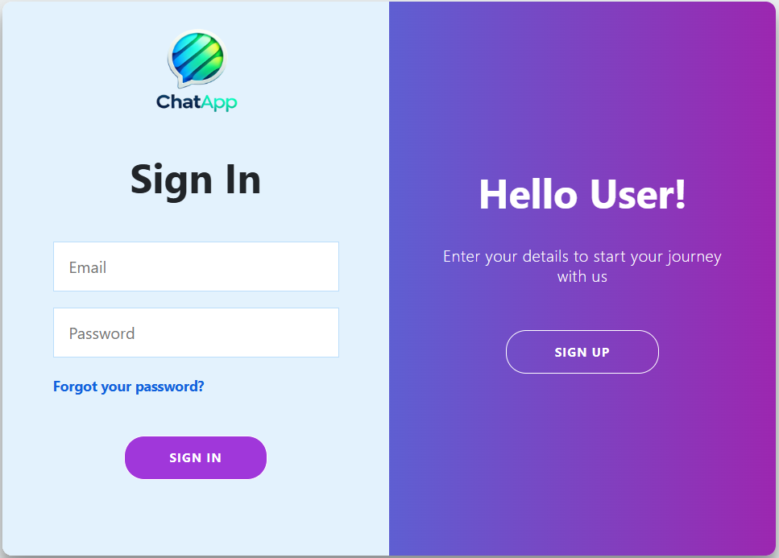

- *Sign Up*  
  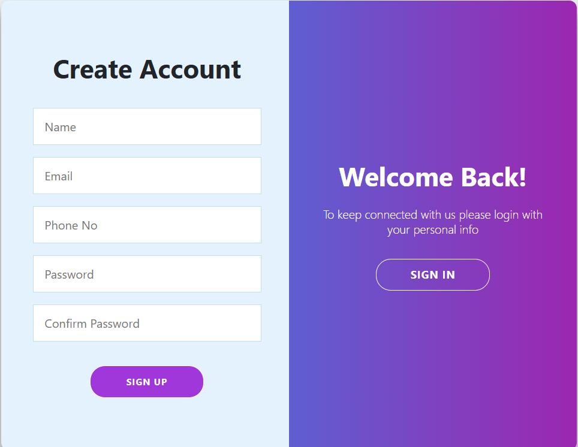

- *Forgot Password*  
  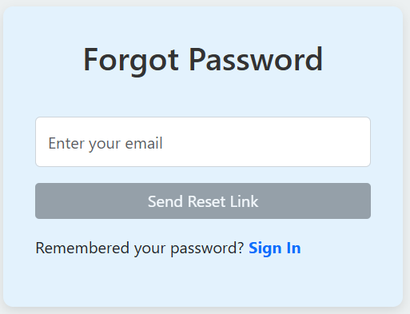

---

### 📇 Contacts
- *Add New Contact*  
  Users can add new friends or colleagues by entering their email. Once added, the contact appears in their chat list for quick access.  
  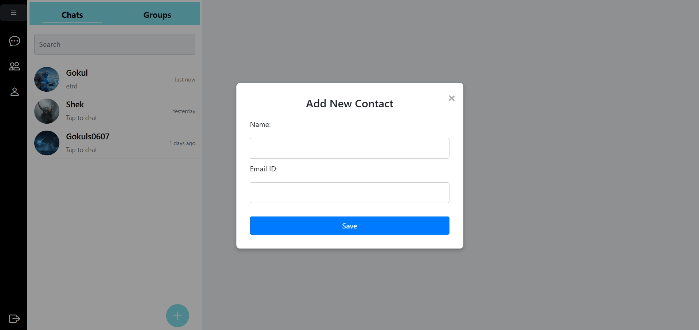

---

### 💬 Chat
- *Chat List*  
  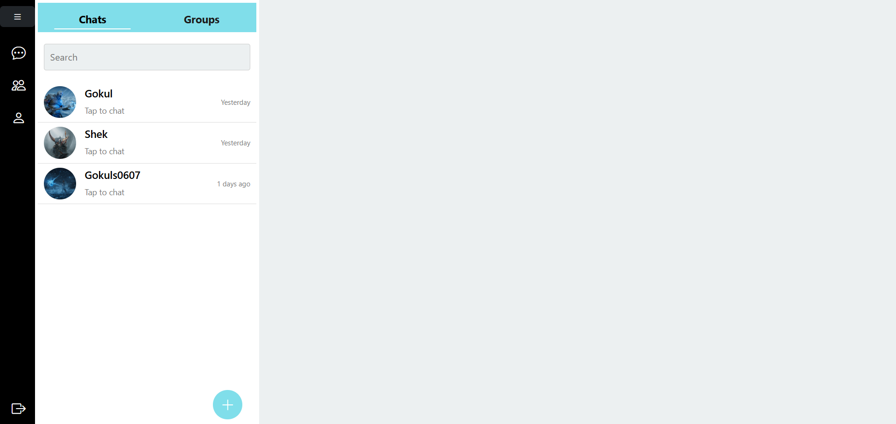

- *One-to-One Chat*  
  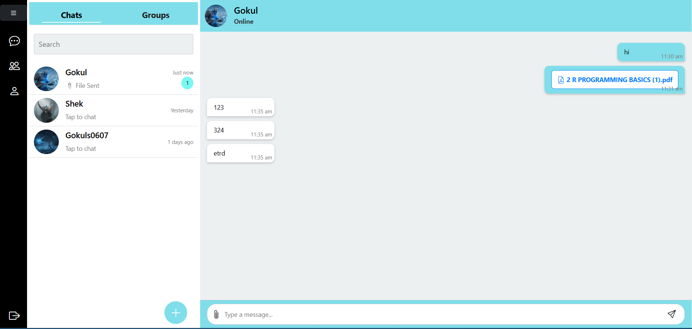

---

### 👥 Groups
- *Group List*  
  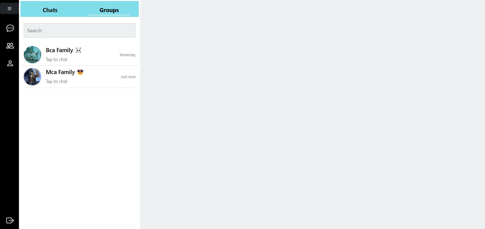

- *Group Chat*  
  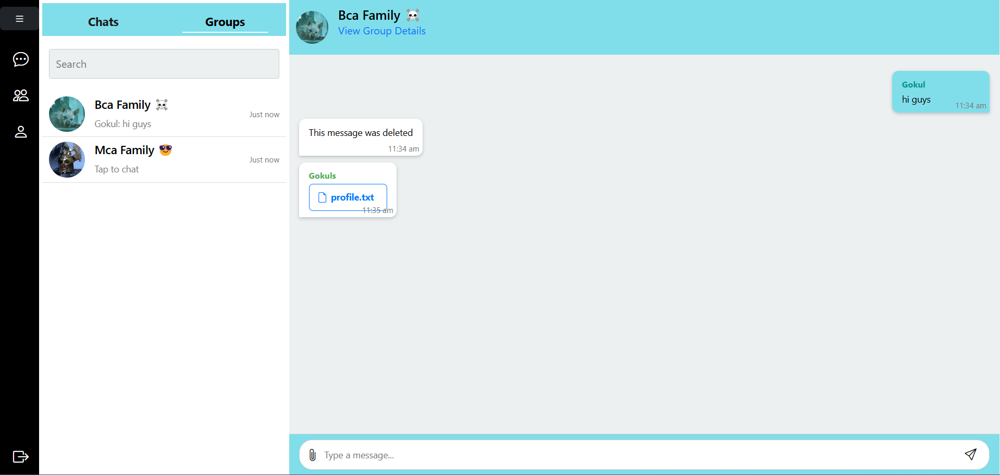

- *Group Creation*  
  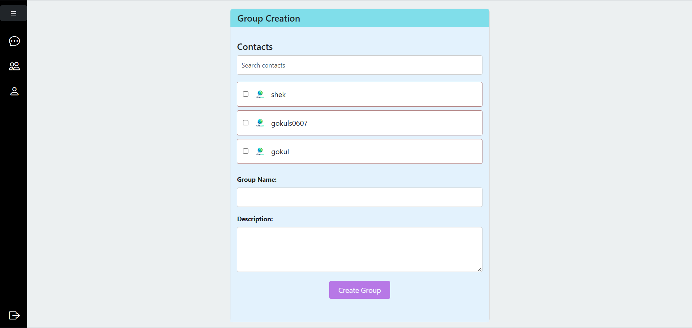

- *View/Edit Group Details*  
  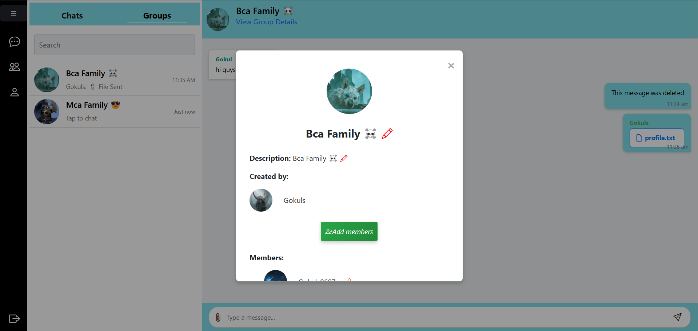

---

### 👤 Profile
- *Profile Management*  
  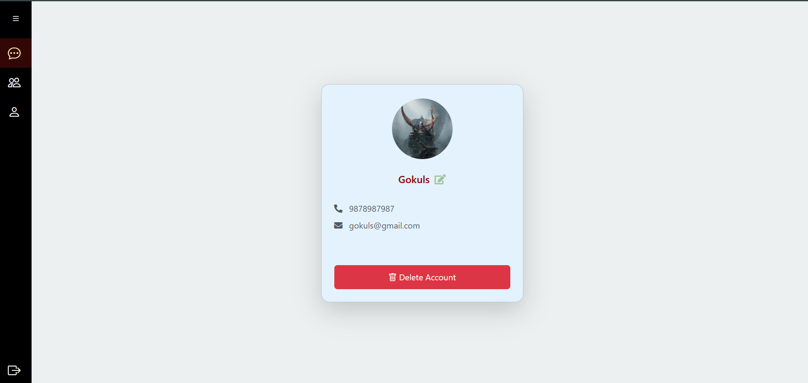

---

## 📜 License
This project is open-source. You can use it for learning and development purposes.
